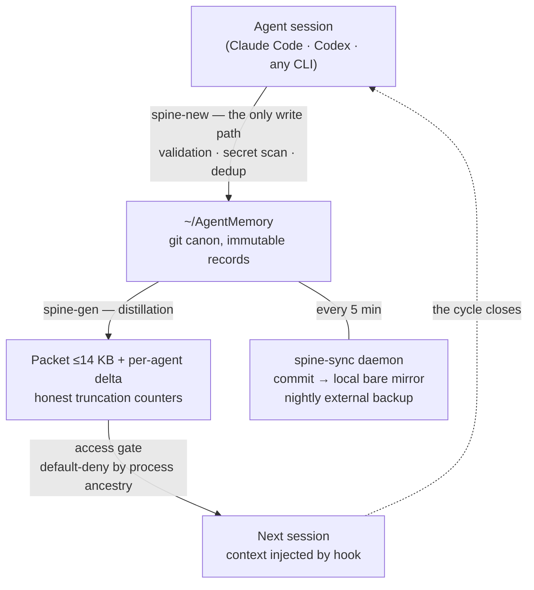

# Memory Spine

**One long-term memory for every AI agent on your machine.**

Claude Code, Codex, Cursor, Aider, any CLI agent — all share a single local memory: plain markdown in a git repo, one disciplined write path, automatic context injection at session start, and a default-deny access gate.

No database. No server. No vendor. Battle-tested in daily production.

🌐 Landing: [memory.bridges.community](https://memory.bridges.community)

## The pattern

- **Markdown records** for durable decisions, facts, threads, and artifacts — one record = one file, immutable (supersede, never edit).
- **One CLI entry point** (`spine-new`): validation, secret scanning, and a dedup gate on every write. Agents never hand-write memory files and never touch git.
- **Push, not pull:** each session automatically receives a distilled **packet** (≤14 KB ≈ 3.5k tokens) — pinned env-facts, decisions, facts, blockers — plus a per-agent **delta** ("what changed while you were away").
- **Default-deny access gate** keyed on process ancestry: only runtimes the owner approved can read memory. Born from a real incident.
- **Git history** for audit, versioning and backup — a single daemon commits every 5 minutes.
- **Honest counters everywhere:** any truncation anywhere is labeled. The system never silently lies about coverage.

## The memory cycle



## Quick start

```bash
git clone https://github.com/AlexBridgesman/memory-spine && cd memory-spine
./install.sh --yes
```

Default install creates:

- `~/AgentMemory` — the memory vault (a local git repo; nothing is pushed anywhere).
- `~/dev/memory-spine/bin` — the CLI tools.
- Example scopes: `personal`, `work`, `ai-infra`, plus an `inbox` for unsorted topics.

Custom scopes and agent names:

```bash
./install.sh --yes \
  --projects "personal,work,research" \
  --agents "claude-code,codex,cursor,user"
```

## Daily use

```bash
# write a durable fact (the ONLY way anything enters memory)
spine-new --type fact --project work --title "Staging DB lives on host X" \
  --agent claude-code --body "Non-secret durable fact."

# what a session receives automatically (or on demand)
spine-packet work

# search the whole corpus (morphology-aware, title+summary+keywords+body)
spine-recall "staging database" --scope work

# chronology: "what did we do on day X"
less ~/AgentMemory/_index/journal.md

# health, selftest, access audit
spine-health && spine-selftest && spine-approve --log
```

## Knowledge lifecycle

- **Types:** `decision` · `fact` · `thread` (open coordination) · `artifact` (pointer, not content).
- **Confidence:** `verified` / `reported` / `candidate` / `untrusted`. External content is always `untrusted` and never auto-injected.
- **Pins:** environment facts (`--pin`) always ride at the top of the packet and never fall out.
- **Inbox:** topics that fit no scope land in `inbox` — only the owner triages (new scope / merge / archive). Delete does not exist.
- **Supersede:** correcting knowledge = a new record with `supersedes:`, never an edit. Git keeps everything.

## The access gate

A third-party desktop app once picked up a global agent profile during onboarding and quietly read the memory packet. That incident became a feature:

- **Default-deny** by process-ancestry chain — unknown callers are refused and the owner gets an alert with a ready-to-paste approve command.
- The allowlist is edited **only by the owner** (`spine-approve`); an agent cannot grant itself access.
- Every access — allowed or denied — lands in an audit log.
- Sandboxed agents (no `ps` available) are resolved through `proc_pidpath`; when identification is impossible, the gate fails open **loudly** (alert) instead of silently breaking legitimate agents — a deliberate, documented trade-off.
- The gate catches agent runtimes launching spine tools. It does not stop a raw `cat` on the vault — which is why rule #1 below is the real last line of defense.

## Reliability

- `spine-selftest` — a 13-test suite covering the write path, secret scanning, packet generation and gate rules.
- `spine-health` — starvation alerts (a scope shipping <35% or zero facts), sync-gap detection, backup staleness.
- A **dead-letter queue** for notifications: undeliverable alerts are retried by the sync cycle within minutes, never lost.
- Atomic writes, locks with TTL, log rotation, fail-closed preflight before any commit.

## Safety rules

1. **Secrets are never stored as values.** Only "name + where it lives" ("API key is in 1Password item X"). A secret scanner runs on every record write and in pre-commit; CI scans the full history.
2. Search for duplicates before adding a record (`spine-recall` first, then ADD / SUPERSEDE / NOOP).
3. Only top-level agents write; subagents return findings.
4. Record at checkpoints, not at session end — context compaction never warns you.
5. Keep cloud remotes optional. Local-first is the safe default.

## Agent integration

- **Claude Code:** merge `config/claude-settings-hooks.json.example` into your `~/.claude/settings.json` — `spine-hook-sessionstart` then injects the packet automatically at session start, and `spine-hook-stop` reminds about unsaved checkpoints.
- **Any other agent:** first action of a session = run `spine-packet <scope>`. Hand the agent `AGENT_INSTALL_PROMPT.md` and it can install and verify the whole system itself.
- **Humans:** the vault opens in Obsidian as a live wikilink graph — every record a dot, every scope a cluster.

## Repository layout

- `bin/` — CLI tools (bash + python3, no dependencies).
- `lib/` — the access gate (`spine_gate.py`).
- `config/` — scope dictionary, agent allowlist, notify/backup examples.
- `hooks/` — git hooks for the vault (pre-commit secret scan).
- `templates/AgentMemory/` — initial vault skeleton.
- `docs/` — architecture and agent rules.
- `.github/workflows/ci.yml` — gitleaks (full history) + selftest on macOS.

## Requirements

- macOS (launchd jobs, Keychain integration optional) or Linux (cron equivalents; core tools are portable).
- `git`, `python3`, a POSIX shell. Recommended: `ripgrep`, `gitleaks`.

## License

MIT.
