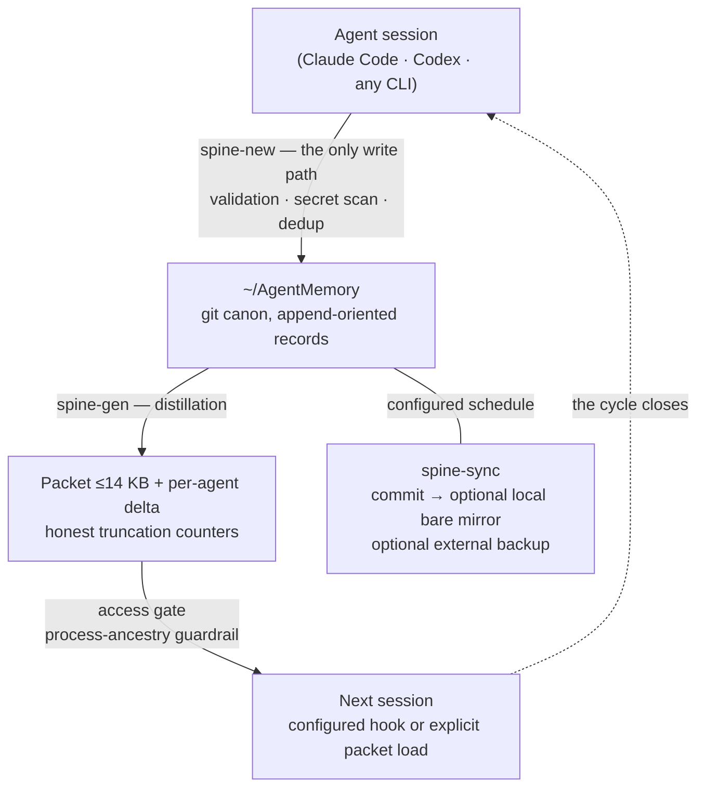

# Memory Spine


**A local-first shared memory OS for CLI agents.**

Memory Spine gives explicitly integrated agents one local memory: plain Markdown in a git repo and one validated write path. Claude Code can use configured session hooks; other shell-capable agents load a bounded packet explicitly.

The core requires no database or hosted memory service and sends no telemetry.

🌐 Landing: [memory.bridges.community](https://memory.bridges.community)

## The pattern

- **Markdown records** for durable decisions, facts, threads, and artifacts — one record = one append-oriented file under the protocol (supersede instead of editing).
- **One CLI entry point** (`spine-new`): validation, a required per-record secret scan, and a probable-duplicate gate on every write (title-token heuristic — it catches near-copies, not semantic twins). The pre-commit hook and CI add gitleaks scans.
- **Explicit integration:** Claude Code can receive a distilled packet through configured hooks; other agents call `spine-packet` at session start.
- **Process-ancestry access gate** for Spine-mediated reads and writes: identified callers not on the owner-managed allowlist are refused. It is a guardrail, not a filesystem sandbox.
- **Git history** for audit, versioning and backup; `spine-sync` can commit on a user-configured schedule.
- **Honest bounded views:** generated packets and indexes label their truncation limits.

## The memory cycle



## Safe install

```bash
git clone https://github.com/AlexBridgesman/memory-spine
cd memory-spine
git tag --sort=-version:refname
git switch --detach <reviewed-tag>
./install.sh          # dry-run: prints targets and writes nothing
./install.sh --apply  # prompts before changing files
```

Default install creates:

- `~/AgentMemory` — the memory vault (a local git repo; nothing is pushed anywhere).
- `~/dev/memory-spine/bin` — the CLI tools.
- Example scopes: `personal`, `work`, `ai-infra`, plus an `inbox` for unsorted topics.

Custom scopes and agent names:

```bash
./install.sh --apply \
  --projects "personal,work,research" \
  --agents "claude-code,codex,cursor,user"
```

## Daily use

```bash
# write a durable fact (the ONLY way anything enters memory)
spine-new --type fact --project work --title "Staging DB lives on host X" \
  --agent claude-code --body "Non-secret durable fact."

# what a configured hook receives, or any agent loads explicitly
spine-packet work

# search the whole corpus (morphology-aware (language packs configurable; Ukrainian and Russian ship enabled), title+summary+keywords+body)
spine-recall "staging database" --scope work

# chronology: "what did we do on day X"
less ~/AgentMemory/_index/journal.md

# health, selftest, access audit
spine-health && spine-selftest && spine-approve --log
```

## Knowledge lifecycle

- **Types:** `decision` · `fact` · `thread` (open coordination) · `artifact` (pointer, not content).
- **Confidence:** `verified` / `reported` / `candidate` / `untrusted`. External content is always `untrusted` and never auto-injected.
- **Pins:** environment facts (`--pin`) always ride at the top of the packet and never fall out.
- **Inbox:** topics that fit no scope land in `inbox` — only the owner triages (new scope / merge / archive). Delete does not exist.
- **Supersede:** correcting knowledge = a new record with `supersedes:`, not an edit. Committed history remains available unless history is explicitly rewritten.

## The access gate

A third-party desktop app once picked up a global agent profile during onboarding and quietly read the memory packet. That incident became a feature:

- **Default-deny for identified callers** by process-ancestry chain — callers absent from the configured allowlist are refused; configured notifications can alert the owner.
- The allowlist is intended to be owner-managed through `spine-approve`; filesystem permissions remain the underlying enforcement boundary.
- Spine-mediated decisions attempt an audit-log entry; filesystem or I/O failure can still prevent logging.
- Sandboxed agents (no `ps` available) are resolved through `proc_pidpath`; when identification is impossible, the gate fails open **loudly** (alert) instead of silently breaking legitimate agents — a deliberate, documented trade-off.
- The gate catches agent runtimes launching spine tools. It does not stop a raw `cat` on the vault — which is why rule #1 below is the real last line of defense.

## Reliability

- `spine-selftest` — an 18-test suite covering write mechanics, inline secret refusal, the dedup gate, supersede semantics, promotion review semantics and packet generation. Access-gate behavior is tested separately.
- `spine-health` — starvation alerts (a scope shipping <35% or zero facts), sync-gap detection, backup staleness.
- A **dead-letter queue** for notifications: undeliverable alerts remain visible locally and can be retried by the sync cycle.
- Atomic writes, locks with TTL, log rotation, fail-closed preflight before any commit.

## The owner's channel (notifications)

Memory that cannot reach its owner is a diary nobody reads. Spine pushes to
your phone; without this configured you are flying blind — set it up right
after install:

**What arrives:**

- **Morning digest** — inbox topics awaiting triage, promotion candidates,
  records assigned to you (`for_agent`), memory totals.
- **Access-gate refusals** — the moment an unapproved runtime touches memory,
  with a ready-to-paste `spine-approve` command.
- **Health alarms** — packet starvation, sync gaps, stale external backups.
- **Delayed re-delivery** — anything undeliverable waits in a dead-letter
  queue for a later retry and is marked `📬 Delayed` when delivery succeeds.

**Setup (pick either channel, or both):** copy
`config/notify.conf.example` to `config/notify.conf`, then

- *Telegram:* create a bot via @BotFather, put your `chat_id` in the config
  and a `token_cmd` that prints the bot token from your secret manager — the
  token value never lives in a file;
- *ntfy:* set `ntfy_url` to a long random topic on ntfy.sh (or your own
  server) and subscribe from the phone app — no bot, no account.

Test with `spine-notify "hello"`, then load the launchd templates
(`launchd/README.md`) so the digest and the sync-cycle delivery run on their
own. Machines that must hold no secrets at all can leave both channels empty:
messages stack up in their local dead-letter queue, and another machine of
yours can drain it over ssh and relay through its own channel — set
`drain_remote_host` in the relaying machine's `notify.conf` (crash-safe: the
retry logic is designed to prefer a duplicate over silently discarding a claimed message).

## Safety rules

1. **Do not store secrets as values.** Store only "name + where it lives". A lightweight scanner runs on every record write; gitleaks runs in pre-commit and CI as defense in depth, not as a guarantee.
2. Search for duplicates before adding a record (`spine-recall` first, then ADD / SUPERSEDE / NOOP).
3. Only top-level agents write; subagents return findings.
4. Record at checkpoints, not only at session end — context compaction may occur without a useful warning.
5. Keep cloud remotes optional. Local-first is the safe default.

## Agent integration

- **Claude Code:** merge `config/claude-settings-hooks.json.example` into your `~/.claude/settings.json` — `spine-hook-sessionstart` then injects the packet automatically at session start, and `spine-hook-stop` reminds about unsaved checkpoints.
- **Any other agent:** first action of a session = run `spine-packet <scope>`. Hand the agent `AGENT_INSTALL_PROMPT.md` and it can install and verify the whole system itself.
- **Humans:** the vault opens in Obsidian as a live wikilink graph — every record a dot, every scope a cluster.

## Repository layout

- `bin/` — CLI tools (bash + Python standard library; external requirements are listed below).
- `lib/` — the access gate (`spine_gate.py`).
- `config/` — scope dictionary, agent allowlist, notify/backup examples.
- `hooks/` — git hooks for the vault (pre-commit secret scan).
- `templates/AgentMemory/` — initial vault skeleton.
- `docs/` — architecture and agent rules.
- `.github/workflows/ci.yml` — pinned gitleaks + selftest on macOS and Linux.
- `benchmarks/recall/` — public synthetic recall regression fixture and runner.
- `website/` — canonical static site source.

## Provenance, not telemetry

The installer writes a birth certificate into **your** vault — `PROVENANCE.md`
plus a genesis record with the install date and template commit/tree/version.
The install path sends no telemetry or unique installation identifier; its
configured git mirror is a local filesystem path. Optional notification tools
are separate and make network calls only after the owner configures a channel.

## Requirements

- macOS (launchd templates, optional Keychain integration) or Linux (explicit cron/systemd scheduling).
- `git`, `python3`, `gitleaks`, and bash. `ripgrep` is optional.

## License

MIT.
